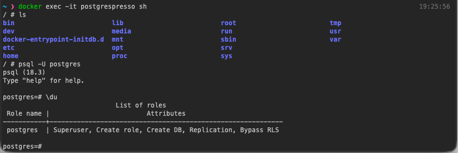

- [x] Create a postgres container and figure out how to connect it to the Go backend.
  - [x] Create a containerised postgres db
    - [x] `~ ❯ docker run --name postgrespresso -e POSTGRES_PASSWORD=<password> -d -p 3005:5432 postgres:alpine`

  - [ ] Validate that I can interact with it through something like dbeaver
  - [ ] Read docs on db connector for Go
  - [ ] Success???
